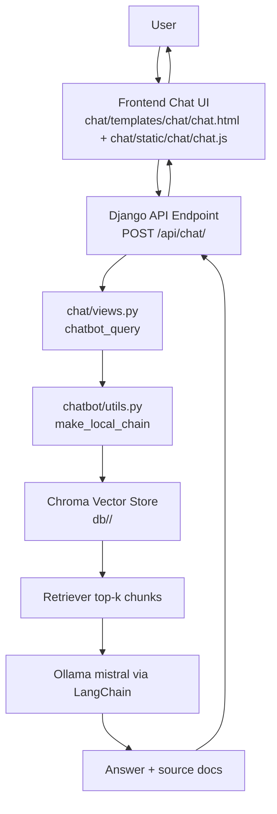
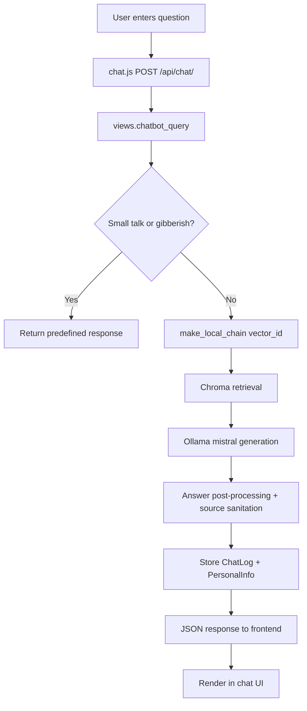
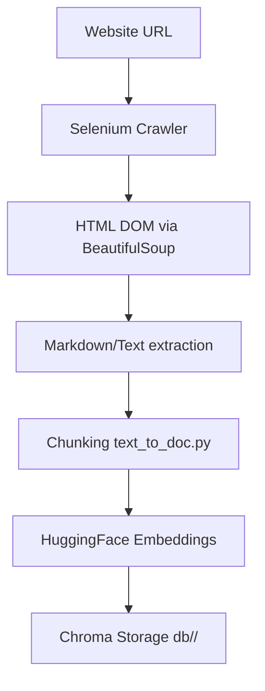
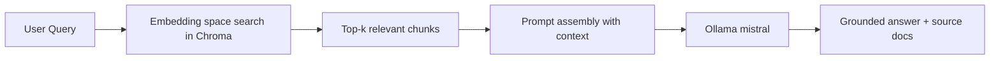

# Project Overview
This project is a Django-based company chatbot that combines website crawling, local vector search, and a local LLM to answer user questions from company website content. It also records user profile details, chat history, and clicked source links for analysis.

# Problem Statement
Company websites usually contain large amounts of distributed information (services, products, contact details, case studies, careers). Users often need quick, conversational answers instead of manually browsing many pages.  
This chatbot solves that by:
- Crawling website pages.
- Converting page content into searchable vector embeddings.
- Retrieving relevant chunks for each question.
- Generating context-grounded answers through an LLM.

# System Architecture
The codebase implements a monolithic Django web app with modular AI utilities:
- `chatbot_ui/`: Django project config and global routing.
- `chat/`: Web UI + API endpoints + interaction logging.
- `chatbot/`: Crawling, chunking, embedding storage, retrieval chain, and prompting.
- `db/`: Persisted Chroma vector stores and crawl cache files.



# Repository Folder Structure
Actual repository structure (focused on source and generated project artifacts):

```text
chatbot/
|-- .git/                         # Git metadata
|-- venv/                         # Local virtual environment (large dependency tree)
|-- chat/
|   |-- migrations/
|   |   |-- 0001_initial.py
|   |   |-- 0002_clickedurl.py
|   |   `-- 0003_remove_chatlog_request_id.py
|   |-- static/
|   |   |-- chat/
|   |   |   |-- chat.js
|   |   |   `-- style.css
|   |   `-- logo/image/
|   |       |-- social.png
|   |       `-- update-info.png
|   |-- templates/chat/chat.html
|   |-- admin.py
|   |-- apps.py
|   |-- db_routers.py
|   |-- models.py
|   |-- tests.py
|   |-- urls.py
|   `-- views.py
|-- chatbot/
|   |-- data/
|   |   |-- crawled_data.json
|   |   |-- crawled_output.docx
|   |   `-- chroma/...
|   |-- pipeline.py
|   |-- prompt.py
|   |-- requirements.txt
|   |-- selenium_multipage_crawler.py
|   |-- text_to_doc.py
|   |-- utils.py
|   |-- web_crawler.py
|   `-- __init__.py
|-- chatbot_ui/
|   |-- asgi.py
|   |-- settings.py
|   |-- urls.py
|   |-- wsgi.py
|   `-- __init__.py
|-- db/
|   |-- Matrix/
|   |   |-- crawled_data.json
|   |   |-- found_urls.json
|   |   |-- seen_urls.json
|   |   |-- chroma.sqlite3
|   |   `-- <chroma index files>
|   |-- webmyne/
|   |   |-- crawled_data.json
|   |   |-- found_urls.json
|   |   |-- seen_urls.json
|   |   |-- chroma.sqlite3
|   |   `-- <chroma index files>
|   |-- default/chroma.sqlite3
|   |-- chroma/chroma.sqlite3
|   `-- chroma.sqlite3
|-- static/                       # Project-level static dir (currently empty)
|-- .gitignore
|-- db.sqlite3
|-- manage.py
|-- OLLAMA setup.docx
|-- README.md
`-- requirements.txt
```

Folder roles:
- `chat/`: Main application logic for UI endpoints, chat APIs, and logging models.
- `chatbot/`: AI pipeline modules for crawling, document chunking, vector storage, and retrieval QA chain.
- `chatbot_ui/`: Django project-level settings and URL composition.
- `db/`: Tenant-wise vector stores (`vector_id` folders) and crawl URL tracking JSON files.
- `chatbot/data/`: Additional generated crawl/vector outputs (legacy/experimental artifacts).
- `venv/`: Environment dependencies, not application source logic.

# Data Flow
When a user sends a message:
1. User submits a question in the browser chat form.
2. `chat/static/chat/chat.js` sends JSON to `POST /api/chat/` with `query` and `vector_id`.
3. `chat/views.py::chatbot_query` validates input and checks greeting/gibberish logic.
4. For normal queries, it runs spelling correction (short tokens) and builds a retrieval chain via `chatbot/utils.py::make_local_chain`.
5. The chain retrieves top chunks from Chroma (`db/<vector_id>/`) and calls Ollama (`mistral`) through LangChain `RetrievalQA`.
6. Backend post-processes answer links, validates source URLs, writes interaction logs to `PersonalInfo`/`ChatLog`, and returns JSON.
7. Frontend displays the answer and logs clicked source URLs to `POST /chat/log-click/`.



# Crawling Pipeline
Crawler behavior is implemented primarily in `chatbot/selenium_multipage_crawler.py` and orchestrated by `chatbot/utils.py::store_docs`.

Pipeline steps:
1. Receive crawl request (`POST /api/crawl/`) with `url` and `vector_id`.
2. Crawl pages with Selenium headless Chrome.
3. Parse HTML using BeautifulSoup.
4. Convert HTML to markdown text (`html2text`).
5. Extract internal links and continue breadth-first up to `max_pages`.
6. Save crawl cache (`crawled_data.json`) and discovered URLs (`found_urls.json`, `seen_urls.json`).
7. Chunk text and embed into Chroma vector store.



# Retrieval Augmented Generation (RAG)
What RAG is:
- RAG retrieves relevant documents first, then passes them to an LLM for answer generation.

Why it is used here:
- Reduces hallucination compared to direct LLM-only answers.
- Grounds responses in crawled company pages.
- Enables tenant-wise knowledge bases via `vector_id`.

How this project implements RAG:
- Retriever: Chroma vector store (`langchain_community.vectorstores.Chroma`).
- Embedding model: HuggingFace `all-MiniLM-L6-v2`.
- Generator model: Ollama local model `mistral`.
- Orchestration: LangChain `RetrievalQA` with a custom system prompt (`chatbot/prompt.py`).



# Key Features
- Website crawling via Selenium with robots.txt and liveness checks.
- Local vector database per company/tenant (`vector_id` isolation).
- Retrieval-based answering with source document tracking.
- Small-talk handling and gibberish detection before costly LLM calls.
- Basic spelling correction for short words (`TextBlob`).
- User profile capture (name/email/phone) per session.
- Chat logging with response time and vector context.
- Clicked-source URL logging for user behavior tracking.

# Technologies Used
- Python: Backend language for Django app and AI pipeline.
- Django: Web framework, routing, views, templates, ORM models.
- LangChain: RetrievalQA chain and prompt orchestration.
- ChromaDB: Persistent local vector database.
- HuggingFace Sentence Transformers: Text embedding model (`all-MiniLM-L6-v2`).
- Ollama: Local LLM runtime using `mistral`.
- Selenium + webdriver-manager: Browser-driven crawling of dynamic pages.
- BeautifulSoup + html2text: HTML parsing and text/markdown extraction.
- SQLite: Default Django DB (`db.sqlite3`) and Chroma SQLite persistence.
- PostgreSQL: Configured `logs` database for `chat` app models through DB router.
- JavaScript/CSS/HTML templates: Frontend chat interface and API calls.

# Important Files
- `manage.py`: Django entry point for runserver, migrations, and management commands.
- `chatbot_ui/settings.py`: Installed apps, static settings, and multi-database configuration (`default` + `logs`).
- `chatbot_ui/urls.py`: Global URL inclusion for admin and chat APIs.
- `chat/views.py`: Main runtime logic for chat responses, crawl API, user info, and URL click logging.
- `chat/models.py`: `PersonalInfo`, `ChatLog`, and `ClickedURL` persistence models.
- `chat/db_routers.py`: Routes all `chat` app model reads/writes/migrations to `logs` DB.
- `chat/urls.py`: API endpoints (`chat/`, `crawl/`, `chat/get-user-name/`, `chat/save-user-info/`, `log-click/`).
- `chat/templates/chat/chat.html`: Chat page template and frontend script/style wiring.
- `chat/static/chat/chat.js`: Frontend chat workflow and API interaction logic.
- `chat/static/chat/style.css`: Chat UI styling.
- `chatbot/pipeline.py`: Public wrappers for retrieve and crawl+embed operations.
- `chatbot/utils.py`: Core RAG implementation (`store_docs`, `make_local_chain`, vector store helpers).
- `chatbot/selenium_multipage_crawler.py`: Multipage crawler, link extraction, robots check.
- `chatbot/text_to_doc.py`: Text cleaning and chunking into LangChain `Document` objects.
- `chatbot/prompt.py`: System prompt and prompt template for retrieval QA.
- `chatbot/web_crawler.py`: Simpler request-based crawler utility (present but not primary in current flow).

Files requested in prompt that are not present by exact name:
- `crawler.py`: Equivalent modules are `chatbot/selenium_multipage_crawler.py` and `chatbot/web_crawler.py`.
- `retriever.py`: Retrieval logic is implemented in `chatbot/utils.py` (`make_local_chain`, `get_relevant_chunks`).
- `ollama_client.py`: Ollama usage is instantiated directly in `chatbot/utils.py` with `Ollama(model="mistral")`.

# Example Query Flow
Example: User asks, "What services does the company provide?"
1. Frontend sends `{"query":"What services does the company provide?","vector_id":"webmyne"}` to `/api/chat/`.
2. Backend builds retrieval chain for `webmyne`.
3. Chroma returns top relevant chunks from `db/webmyne/chroma.sqlite3` and index files.
4. LangChain passes retrieved context to Ollama `mistral` using the custom system prompt.
5. Backend sanitizes links to keep only URLs present in source metadata.
6. Backend logs query/response in `ChatLog`.
7. Frontend renders answer and user can click cited links (which are logged via `/chat/log-click/`).

# Topics Covered During Internship
- Retrieval Augmented Generation (RAG) design and implementation.
- Web crawling and content extraction from dynamic websites.
- Text preprocessing, chunking, and embedding pipelines.
- Vector database persistence and similarity retrieval.
- LLM integration using local model serving (Ollama).
- Full-stack chatbot integration (Django backend + JS frontend).
- Session-based user interaction logging and analytics.
- Multi-database routing in Django (SQLite + PostgreSQL).

# Challenges
Observed implementation challenges from code and structure:
- Coordinating two databases (`default` SQLite and `logs` PostgreSQL) with router-based model routing.
- Keeping crawled links and generated links trustworthy (post-generation link cleanup logic is required).
- Managing crawler reliability/performance for dynamic pages (Selenium startup and page wait times).
- Handling noisy web text and preserving useful context during chunking.
- Maintaining accurate tenant separation by `vector_id`.
- Limited automated tests (`chat/tests.py` is currently a placeholder).

# Future Improvements
- Replace hardcoded secrets and DB credentials in settings with environment variables.
- Make `vector_id` selectable in UI instead of hardcoded `webmyne`.
- Add stronger automated test coverage (views, crawler, retrieval chain, DB router).
- Add async/background job queue for crawling and embedding (avoid long synchronous requests).
- Improve crawl deduplication and URL tracking consistency for `seen_urls`/`found_urls`.
- Add structured observability (request tracing, retrieval metrics, prompt/response diagnostics).
- Add authentication/authorization for admin or multi-tenant production deployments.

# Conclusion
This repository implements a complete local RAG chatbot platform: crawl website data, convert it to vector-searchable knowledge, retrieve relevant context, and generate grounded responses via Ollama. The project demonstrates practical integration across crawling, NLP preprocessing, vector retrieval, LLM generation, and web application engineering, making it a strong internship evaluation case for applied AI software development.
